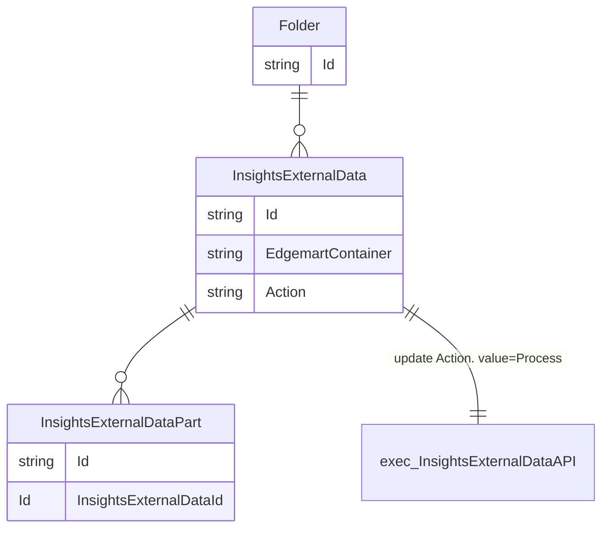

# はじめに

Salesforce が提供する [Einstein Analytics](https://www.salesforce.com/jp/blog/2017/06/introducing-einstein-analytics.html) に Apex を使用し CSV データをアップロードする方法を解説します。

## この記事でわかること

:::message

- InsightsExternalData API を使って Einstein Analytics へ CSV をアップロードする方法

:::

## この記事を読む上での前提条件

:::message alert

- Apex の書き方の基本などは習得済みの前提です
- Einstein Analytics を試せるデベロッパー環境は準備済みの前提です
  - 用意されてない方は [こちら](https://trailhead.salesforce.com/ja/promo/orgs/analytics-de) よりアカウントを発行してください。

:::

## この記事で取り扱わないこと

:::message alert

- salesforce のオブジェクトや Apex の記法などについての詳細的な解説はしません。
  :::

## 環境情報

- sfdx-cli v7.152.0

## GitHub

https://github.com/akkie-i/lwc-samples

# Einstein Analytics にアップロード先を作成する

アプリケーションランチャーから `Analytics Studio` を選択


右上の `作成` をクリックして `アプリケーション` を選択


`空のアプリケーションを作成` をクリック


`次へ` をクリック


アプリケーション名を `サンプル` と入力して `作成` をクリック


空のアプリケーションが作成されました。次にデータを挿入してみます。右上の `作成` をクリックして `データセット` を選択


データ登録方法として `CSVファイル` を選択


適当な CSV をアップロードして `次へ` をクリック
::: details サンプルとしてこちらの CSV を使ってます

```csv
名前,メール,性別,年齢,出身
taro,taro@example.com,男,20,千葉
```

:::


先ほどの CSV にデータセット名をつけて `次へ` をクリック
ここでのデータセット名は必ず英語で指定してください。また、データスキーマファイルの欄から json ファイルをダウンロードしておいてください。後ほど説明します。


アップロードするデータを確認し `ファイルをアップロード` をクリック


データセットが追加されたことを確認できます。そのまま赤枠のセクションをクリック


グラフィックでデータ状況を確認できます。現在の行数が 1 行になっているので先ほどのデータがアップロードされたことが確認できます


# データがアップロードされるまでの流れ

アップロード先の作成と一緒に 1 件データもアップロードしてみましたが、これがどういう仕組みでアップロードされているのかを確認してみます。

アップロードには [Insights External Data API](https://developer.salesforce.com/docs/atlas.ja-jp.bi_dev_guide_ext_data.meta/bi_dev_guide_ext_data/bi_ext_data_overview.htm) が使われています。

ドキュメント内に [InsightsExternalData オブジェクト](https://developer.salesforce.com/docs/atlas.ja-jp.bi_dev_guide_ext_data.meta/bi_dev_guide_ext_data/bi_ext_data_object_externaldata.htm) と [InsightsExternalDataPart オブジェクト](https://developer.salesforce.com/docs/atlas.ja-jp.bi_dev_guide_ext_data.meta/bi_dev_guide_ext_data/bi_ext_data_object_externaldatapart.htm) がありますが、こちらの理解が必要なので順番に確認します。

## InsightsExternalData オブジェクト

このオブジェクトは **どのアプリケーションにどのデータセットを使用し、どんなアクションを与えるか** を定義するオブジェクトになります。

オブジェクトの項目がどのような役割なのかを必要な部分に絞って説明します。

- `EdgemartContainer`
  - どのアプリケーションかを指定します。
- `EdgemartAlias`
  - データセットの項目名を指定します。
  - 先ほどのデータセット作成時に「データセット名」に指定した箇所です
  - こちらは通常の salesforce オブジェクトの命名規則に沿う必要があるので必ず英語で設定すると補足を入れました
- `MetadataJson`
  - データセットの構造情報です。要は CSV のヘッダー情報です
  - データセット作成時に json をダウンロードしてもらったかと思いますがそちらになります
  - こちらの json は構造は [メタデータ形式リファレンス](https://developer.salesforce.com/docs/atlas.ja-jp.240.0.bi_dev_guide_ext_data_format.meta/bi_dev_guide_ext_data_format/bi_ext_data_schema_reference.htm)に沿って作成されています。
- `Format`
  - アップロードデータのタイプを `Csv` か `Binary` で指定します
- `Operation`
  - どのアクションかを指定します。`Overwrite` `Append` `Upsert` `Delete` から選べます
- `Action`
  - データ処理状況を指定します。デフォルト `None` で `Process` に変更すると処理が開始しアップロード処理が始まります

SOQL でオブジェクトの中身を確認するともう少し理解が深まるのでこちらも確認してみましょう。

以下の SOQL を実行してください

```sql
SELECT Id,EdgemartAlias,Operation,EdgemartContainer,Action,Status,StatusMessage,MetadataJson FROM InsightsExternalData
```

実行結果は以下です。

| Id                 | EdgemartAlias | Operation | EdgemartContainer  | Action  | Status    | StatusMessage | MetadataJson                                                                       |
| ------------------ | ------------- | --------- | ------------------ | ------- | --------- | ------------- | ---------------------------------------------------------------------------------- |
| 06V2w000000pIvdEAE | sample        | Overwrite | 00l2w0000022tA7AAI | Process | Completed | null          | /services/data/v56.0/sobjects/InsightsExternalData/06V2w000000pIvdEAE/MetadataJson |

`EdgemartAlias` にデータセットで指定した名前が設定されていますね。
`EdgemartContainer` は ID になっており、作成したアプリケーション ID っぽいですが、どのオブジェクトの ID に紐づいているのでしょうか。

正解は [Folder](https://developer.salesforce.com/docs/atlas.ja-jp.object_reference.meta/object_reference/sforce_api_objects_folder.htm)オブジェクトです。

確認のために以下の SOQL を実行ください。

```sql
SELECT Id,Name,Type From Folder WHERE Type='Insights'
```

実行結果は以下です。

| Id                 | Name     | Type     |
| ------------------ | -------- | -------- |
| 00l2w0000022tA7AAI | サンプル | Insights |

`Name` に作成したアプリケーションの名前が確認できて `Id` と `EdgemartContainer` の値が一緒で紐づいてることが確認できます。

## InsightsExternalDataPart オブジェクト

このオブジェクトはファイルデータを格納するオブジェクトです。

こちらも項目をいくつか説明します。

- `InsightsExternalDataId`
  - InsightsExternalData オブジェクトへの参照 ID です
- `DataFile`
  - データ(CSV)の実データです
  - `MetadataJson` で構造を指定してるのでそちらにあったカラム数、データ型の CSV ストリングである必要があります
- `PartNumber`
  - 同じ参照 ID で複数データ登録した時は連番で指定します

同様に SOQL も確認してみます。

以下を実行ください。( `WHERE='06V2w000000pIvdEAE'` の値はご自身のデータによって変更ください)

```sql
SELECT InsightsExternalDataId,DataFile,PartNumber FROM InsightsExternalDataPart WHERE InsightsExternalDataId='06V2w000000pIvdEAE'
```

実行結果は以下です。

| InsightsExternalDataId | DataFile                                                                           | PartNumber |
| ---------------------- | ---------------------------------------------------------------------------------- | ---------- |
| 06V2w000000pIvdEAE     | /services/data/v56.0/sobjects/InsightsExternalDataPart/06W2w000000r7C3EAI/DataFile | 1          |

`InsightsExternalDataId` が `InsightsExternalData` の `Id` と紐づいていることが確認できますね。

## API 実行までのオブジェクト関連図

ここまでの説明のまとめとして下記に沿ってオブジェクトのリレーションを設定しアップロードするデータを登録したら `InsightsExternalData` のカラム `Action` を `Process` にすることで InsightsExternalData API が実行され、アップロードされるのが全体の流れになります。



# Apex で CRUD 処理を実装

アップロードまでの流れを確認できたので実際にデータの追加や削除などを確認して確認してみましょう。

`InsightsExternalDataController.cls` という Apex クラスを作成して以下の編集をしてください。

```java: InsightExternalDataController.cls
public with sharing class InsightsExternalDataController {

    public static void executeProcess() {

        // InsightExternalDataの作成 ---------------------------------

        // 自身のアプリケーションIDに変更
        // 確認方法: 下記を実行しNameがEinstein Analyticsのアプリケーション作成時に指定したアプリケーション名と一致するID
        // SELECT Id,Name FROM Folder WHERE Type='Insights'
        String applicationId = '00l2w0000022tA7AAI';
        // 自身で Einstein Analyticsのアプリケーション作成時に指定したデータセット名に変更
        String edgemartAlias = 'sample';
        // MetadataJsonをBase64エンコードした値を設定。エンコードはwebの適当なツールをご利用ください
        String encodedMetaJson = 'ew0KICAiZmlsZUZvcm1hdCI6IHsNCiAgICAiY2hhcnNldE5hbWUiOiAiVVRGLTgiLA0KICAgICJmaWVsZHNEZWxpbWl0ZWRCeSI6ICIsIiwNCiAgICAibGluZXNUZXJtaW5hdGVkQnkiOiAiXG4iDQogIH0sDQogICJvYmplY3RzIjogWw0KICAgIHsNCiAgICAgICJjb25uZWN0b3IiOiAiQ1NWIiwNCiAgICAgICJmdWxseVF1YWxpZmllZE5hbWUiOiAic2FtcGxlX2NzdiIsDQogICAgICAibGFiZWwiOiAic2FtcGxlLmNzdiIsDQogICAgICAibmFtZSI6ICJzYW1wbGVfY3N2IiwNCiAgICAgICJmaWVsZHMiOiBbDQogICAgICAgIHsNCiAgICAgICAgICAiZnVsbHlRdWFsaWZpZWROYW1lIjogIkNvbHVtbjEiLA0KICAgICAgICAgICJuYW1lIjogIkNvbHVtbjEiLA0KICAgICAgICAgICJ0eXBlIjogIlRleHQiLA0KICAgICAgICAgICJsYWJlbCI6ICLlkI3liY0iDQogICAgICAgIH0sDQogICAgICAgIHsNCiAgICAgICAgICAiZnVsbHlRdWFsaWZpZWROYW1lIjogIkNvbHVtbjIiLA0KICAgICAgICAgICJuYW1lIjogIkNvbHVtbjIiLA0KICAgICAgICAgICJ0eXBlIjogIlRleHQiLA0KICAgICAgICAgICJsYWJlbCI6ICLjg6Hjg7zjg6siDQogICAgICAgIH0sDQogICAgICAgIHsNCiAgICAgICAgICAiZnVsbHlRdWFsaWZpZWROYW1lIjogIkNvbHVtbjMiLA0KICAgICAgICAgICJuYW1lIjogIkNvbHVtbjMiLA0KICAgICAgICAgICJ0eXBlIjogIlRleHQiLA0KICAgICAgICAgICJsYWJlbCI6ICLmgKfliKUiDQogICAgICAgIH0sDQogICAgICAgIHsNCiAgICAgICAgICAiZnVsbHlRdWFsaWZpZWROYW1lIjogIkNvbHVtbjQiLA0KICAgICAgICAgICJuYW1lIjogIkNvbHVtbjQiLA0KICAgICAgICAgICJ0eXBlIjogIk51bWVyaWMiLA0KICAgICAgICAgICJsYWJlbCI6ICLlubTpvaIiLA0KICAgICAgICAgICJwcmVjaXNpb24iOiAxOCwNCiAgICAgICAgICAiZGVmYXVsdFZhbHVlIjogIjAiLA0KICAgICAgICAgICJzY2FsZSI6IDAsDQogICAgICAgICAgImZvcm1hdCI6ICIwIg0KICAgICAgICB9LA0KICAgICAgICB7DQogICAgICAgICAgImZ1bGx5UXVhbGlmaWVkTmFtZSI6ICJDb2x1bW41IiwNCiAgICAgICAgICAibmFtZSI6ICJDb2x1bW41IiwNCiAgICAgICAgICAidHlwZSI6ICJUZXh0IiwNCiAgICAgICAgICAibGFiZWwiOiAi5Ye66LqrIg0KICAgICAgICB9DQogICAgICBdDQogICAgfQ0KICBdDQp9DQo=';
        // Append, Overwrite, Upsert, Delete, からやりたい処理に変更
        String operation = 'Append';
        InsightsExternalData externalData = InsightsExternalDataController.createBody(edgemartAlias,applicationId,encodedMetaJson,operation);

        // InsightExternalDataPartの作成 -----------------------------

        String externalDataId = externalData.Id;
        List<String> encodedCsvData = new List<String>();
        encodedCsvData.add('5ZCN5YmNLOODoeODvOODqyzmgKfliKUs5bm06b2iLOWHuui6qw0KaWNoaXJvLGljaGlyb0BleGFtcGxlLmNvbSznlLcsNTAs5oSb55+l');
        InsightsExternalDataController.createParts(externalDataId,encodedCsvData);

        // InsightExternalDataのAction更新 ---------------------------

        InsightsExternalDataController.updateBody(externalDataId);
        System.debug(externalDataId);
        // externalDataIdを使って以下のクエリー実行しながら結果を監視してください。
        // SELECT Id,EdgemartAlias,Operation,EdgemartContainer,Action,Status,StatusMessage,MetadataJson FROM InsightsExternalData WHERE Id='06V2w000000pJX7EAM'
    }

    @AuraEnabled
    public static InsightsExternalData createBody(String edgemartAlias, String edgemartContainer, String metaDataJsonString, String Operation) {
        // MetadataJsonはエンコードデータをデコードしてBlob型に変換する必要がある
        Blob jsonDecode = System.EncodingUtil.base64Decode(metaDataJsonString);
        InsightsExternalData externalData = new InsightsExternalData();
        externalData.put('Format', 'Csv');
        externalData.put('EdgemartAlias', edgemartAlias);
        externalData.put('MetadataJson', jsonDecode);
        externalData.put('Operation', Operation);
        externalData.put('Action', 'None');
        externalData.put('EdgemartContainer', edgemartContainer);
        try {
            insert externalData;
            return externalData;
        } catch(DmlException e) {
            throw e;
        }
    }
    @AuraEnabled
    public static void createParts(String externalDataId, String[] csvFileString) {

        try {
            List<InsightsExternalDataPart> externalDataParts = new List<InsightsExternalDataPart>();
            for (Integer i = 0; i < csvFileString.size(); i++) {
                // CSVデータはエンコードデータをデコードしてBlob型に変換する必要がある
                Blob csvFile = System.EncodingUtil.base64Decode(csvFileString[i]);
                InsightsExternalDataPart externalDataPart = new InsightsExternalDataPart();
                externalDataPart.put('InsightsExternalDataId', externalDataId);
                externalDataPart.put('DataFile', csvFile);
                externalDataPart.put('PartNumber', i + 1);
                externalDataParts.add(externalDataPart);
            }
            insert externalDataParts;
        } catch(DmlException e) {
            throw e;
        }
    }

    @AuraEnabled
    public static void updateBody(String externalDataId) {
        try {
            InsightsExternalData[] processes = [
                SELECT Action FROM InsightsExternalData WHERE Id =:externalDataId
            ];
            for (InsightsExternalData externalData : processes) {
                externalData.Action = 'Process';
            }
            update processes;
        } catch(DmlException e) {
            throw e;
        }
    }
}
```

以下、各メソッドの概要でメソッド実行用のエントリーポイントとして `executeProcess` を準備してますのでエントリーポイントの値を適宜修正しながら処理を実行していきます。

- `createBody`
  - `InsightsExternalData` を作成するメソッド
- `createParts`
  - `InsightsExternalDataPart` を作成するメソッド
- `updateBody`
  - `InsightsExternalData` の `Action` を `Process` に変更するメソッド

また、実行は salesforce の開発コンソールから `Open Execute Anonymous Window` からエントリーポイントを実行ください。


## Append

先ほどのサンプルのコードは `Append` で設定してあるのでそのまま実行してみます。
ちなみに `Append` はデータを追加するアクションになります。

追加データは以下とします。

```csv
名前,メール,性別,年齢,出身
hanako,hanako@example.com,女,20,東京
ichiro,ichiro@example.com,男,50,愛知
```

実行したらデータが追加されていることが確認できるかと思います。
反映まで時間がかかるかもしれないので `executeProcess` の一番下の SOQL を実行して状況を確認してください。反映が完了した場合は `Status` の値が `Completed` になっているかと思います。


## Upsert

次に重複データが存在したら更新、新規データなら追加する `Upsert` を試してみます。

`Operation` の補足に `Upsert` にはユニークの値が必要とあります。


まずこの挙動を検証してみたいと思います。

### ユニーク制約がない場合の Upsert の挙動

検証データとして以下を使用します。1 件更新データで 1 件は追加データです。

```csv
名前,メール,性別,年齢,出身
ichiro,ichiro@example.com,男,999,愛知
jiro,jiro@example.com,男,18,千葉
```

以下の修正をして、`executeProcess` を実行ください。

```diff java: InsightExternalDataController.cls
public with sharing class InsightsExternalDataController {

    public static void executeProcess() {

        // InsightExternalDataの作成 ---------------------------------

        // 省略

        // Append, Overwrite, Upsert, Delete, からやりたい処理に変更
-       String operation = 'Append';
+       String operation = 'Upsert';
        InsightsExternalData externalData = InsightsExternalDataController.createBody(edgemartAlias,applicationId,encodedMetaJson,operation);

        // InsightExternalDataPartの作成 -----------------------------

        String externalDataId = externalData.Id;
        List<String> encodedCsvData = new List<String>();
-       encodedCsvData.add('元々のエンコードした値');
+       encodedCsvData.add('今回追加分のcsvデータをエンコードした値');
        InsightsExternalDataController.createParts(externalDataId,encodedCsvData);

        // 省略
    }
    // 省略
```

実行すると`FIELD_INTEGRITY_EXCEPTION, 各オブジェクトには一意の ID を持つ項目が 1 つ必要です。オブジェクト [sample_csv] に一意の ID を持つ項目がありません。: [MetadataJson]` とエラーが表示されることが確認できます。


### MetaDataJson にユニーク制約を追加して Overwrite する

ユニーク制約は MetadataJson で定義します。([参考](https://developer.salesforce.com/docs/atlas.ja-jp.240.0.bi_dev_guide_ext_data_format.meta/bi_dev_guide_ext_data_format/bi_ext_data_schema_reference.htm))


また、どうやら `Overwrite` することでデータセットを置き換えることができるようですのでこちらで変更してしまいます。(ユニーク制約を追加した json を別のデータセットとして追加するなどのアプローチもありです)


アプリケーション作成時にダウンロードした json ファイルにユニーク制約を追加します。
検証で使ってるデータの中ではメールアドレスが一意として使えそうなので `メール` にユニーク制約を追加します。

```diff json
{
  "fileFormat": {
    "charsetName": "UTF-8",
    "fieldsDelimitedBy": ",",
    "linesTerminatedBy": "\n"
  },
  "objects": [
    {
      "connector": "CSV",
      "fullyQualifiedName": "sample_csv",
      "label": "sample.csv",
      "name": "sample_csv",
      "fields": [
        {
          "fullyQualifiedName": "Column2",
          "name": "Column2",
          "type": "Text",
          "label": "メール",
+         "isUniqueId": true
        }
        // 省略
      ]
    }
  ]
}
```

この修正した json と以下の csv データをエンコードしたデータを取得してください。

```csv
名前,メール,性別,年齢,出身
taro,taro@example.com,男,20,千葉
hanako,hanako@example.com,女,20,東京
ichiro,ichiro@example.com,男,50,愛知
```

取得したデータをもとに Apex に修正を加えます。

```diff java: InsightExternalDataController.cls
public with sharing class InsightsExternalDataController {

    public static void executeProcess() {

        // InsightExternalDataの作成 ---------------------------------

        // 省略
-       String encodedMetaJson = '元々のエンコードした値';
+       String encodedMetaJson = 'ユニーク制約を追加したMetadataJsonをエンコードした値';
        // Append, Overwrite, Upsert, Delete からやりたい処理に変更
-       String operation = 'Upsert';
+       String operation = 'Overwrite';
        InsightsExternalData externalData = InsightsExternalDataController.createBody(edgemartAlias,applicationId,encodedMetaJson,operation);

        // InsightExternalDataPartの作成 -----------------------------

        String externalDataId = externalData.Id;
        List<String> encodedCsvData = new List<String>();
-       encodedCsvData.add('元々のエンコードした値');
+       encodedCsvData.add('overwrite用のcsvデータをエンコードした値');
        InsightsExternalDataController.createParts(externalDataId,encodedCsvData);

        // 省略
    }
    // 省略
```

こちらで `executeProcess` を実行します。
これで `Append` を検証した時までのデータを維持しつつ `メール` カラムにユニーク制約が追加されたデータセットに変更されました。

### ユニーク制約を追加した Upsert の挙動

では、`Upsert` をあらためて検証してみましょう。

以下の csv をエンコードした値を取得します。

```csv
名前,メール,性別,年齢,出身
ichiro,ichiro@example.com,男,999,愛知
jiro,jiro@example.com,男,18,千葉
```

取得した値を使用して Apex に以下の編集を加えます。

```diff java: InsightExternalDataController.cls
public with sharing class InsightsExternalDataController {

    public static void executeProcess() {

        // InsightExternalDataの作成 ---------------------------------

        // 省略

        // Append, Overwrite, Upsert, Delete からやりたい処理に変更
-       String operation = 'Overwrite';
+       String operation = 'Upsert';
        InsightsExternalData externalData = InsightsExternalDataController.createBody(edgemartAlias,applicationId,encodedMetaJson,operation);

        // InsightExternalDataPartの作成 -----------------------------

        String externalDataId = externalData.Id;
        List<String> encodedCsvData = new List<String>();
-       encodedCsvData.add('元々のエンコードした値');
+       encodedCsvData.add('Upsert用のcsvデータをエンコードした値');
        InsightsExternalDataController.createParts(externalDataId,encodedCsvData);

        // 省略
    }
    // 省略
```

こちらで `executeProcess` を実行します。データに追加と更新がされていることを確認できます。


## Delete

`Delete` でデータの削除を確認してみます。
`Upsert` と同様にこちらにもユニーク制約が必要になります。

すでに現在の `MetadataJson` にはユニーク制約が追加されているので以下の csv データをエンコードした上で Apex に修正を加え、`executeProcess` を実行します。

```csv
名前,メール,性別,年齢,出身
taro,taro@example.com,男,20,千葉
```

```diff java: InsightExternalDataController.cls
public with sharing class InsightsExternalDataController {

    public static void executeProcess() {

        // InsightExternalDataの作成 ---------------------------------

        // 省略

        // Append, Overwrite, Upsert, Delete からやりたい処理に変更
-       String operation = 'Upsert';
+       String operation = 'Delete';
        InsightsExternalData externalData = InsightsExternalDataController.createBody(edgemartAlias,applicationId,encodedMetaJson,operation);

        // InsightExternalDataPartの作成 -----------------------------

        String externalDataId = externalData.Id;
        List<String> encodedCsvData = new List<String>();
-       encodedCsvData.add('元々のエンコードした値');
+       encodedCsvData.add('Delete用のcsvデータをエンコードした値');
        InsightsExternalDataController.createParts(externalDataId,encodedCsvData);

        // 省略
    }
    // 省略
```

対象のデータが削除されたことが確認できます。


## ユニーク制約がある場合追加はできない

一通りの Action は確認できましたが、最後にドキュメントに記載されているユニーク制約がある場合は `Append` はできないを確認してみます。


これまでやった流れで適当な csv の追加データのエンコードデータを作成して、Apex を修正して `executeProcess` を実行してみてください。

実行結果として `オブジェクト [sample_csv] の項目 [Column2] は、「追加」操作用のメタデータファイルで一意の ID を持つ項目として指定できません。 : [MetadataJson]` のエラーメッセージを確認できるかと思います。


## Action の使い分けまとめ

全 Action の正常動作から制約により発生するエラーを一通り確認できたので各アクションの使い分けを以下に記載します。

- `MetadataJson` にユニーク値を設定をせず追加のみを想定している場合
  - `Append`
- `MetadataJson` にユニーク値を設定する項目はないが追加、既存データの更新、削除をしたい場合
  - `Overwrite`
  - ※この場合これまでアップロードしてきた csv データが残っている必要があります。
- `MetadataJson` にユニーク値を設定する項目が存在していて、追加、既存データの更新、削除をしたい場合
  - `Upsert`
  - `Delete`

# さいごに

さいごまで読んでいただきありがとうございます。

少しニッチな領域ですが、InsightsExternalData API に関する記事はそんなに多くないので誰かに刺さる記事になったら幸いです。

次はこちらをベースにデータアップロードを LWC 化してみたりしてみようかと思います。

間違いの指摘やリクエストなどありましたら加筆していきたので是非、ご意見をいただけたらと思います。

それではまた次の記事でお会いしましょう。
