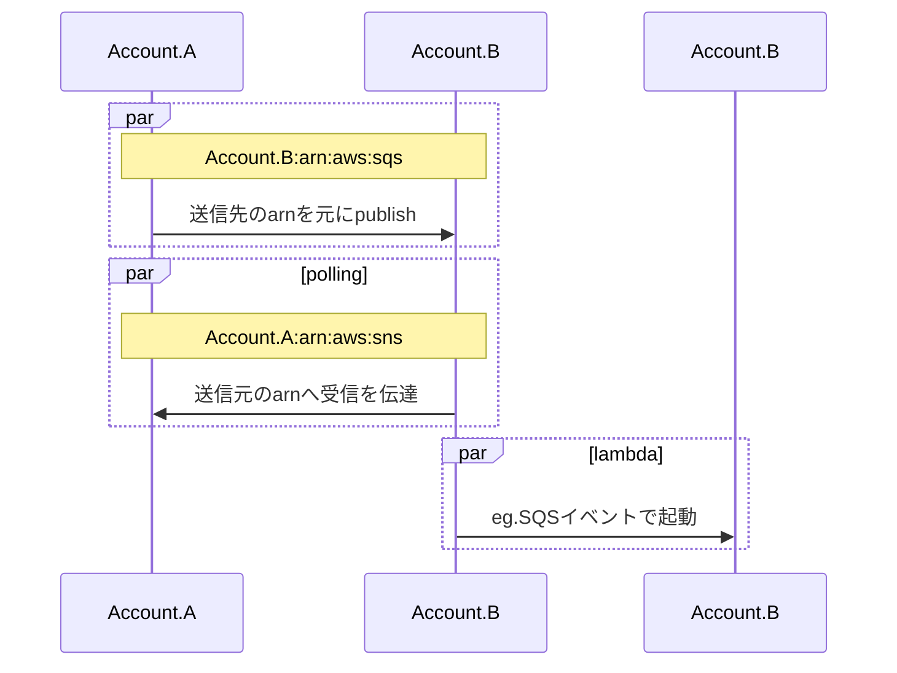

# はじめに

AWS で大体セットで紹介される[SNS](https://docs.aws.amazon.com/ja_jp/sns/latest/dg/welcome.html)と[SQS](https://docs.aws.amazon.com/ja_jp/AWSSimpleQueueService/latest/SQSDeveloperGuide/welcome.html)を組み合わせたキューイング処理についての話です。

今回はその中でも別々の AWS アカウント同士、いわゆるクロスアカウントで SNS→SQS を連携させるための設定方法について書いていきます。

https://docs.aws.amazon.com/ja_jp/sns/latest/dg/sns-send-message-to-sqs-cross-account.html

以下、概要図です。



※SNS→SQS の後はキューの受信をトリガーに Lambda を起動させる使用例として一応載せてますが、今回の記事のスコープは `Account.A` `Account.B` を連携するための設定のみです。

# Step.1 Account.A で SNS の作成

マネージメントコンソールより `sns` を検索します。


任意のトピック名を入力 → `次のステップ` をクリック(今回はトピック名を `CrossAccess-test1` とする)


そのまま `トピックの作成` をクリック


トピックが作成されますので `ARN` に記載されている値を控えておきます。


# Step.2 Account.B で SQS の作成

マネージメントコンソールより `sqs` を検索します。


`キューを作成` をクリック


任意のキューの名前を設定(今回は `CrossAccess-test1` とする)


いったん特に何も設定せずに `キューを作成` をクリック


キューの作成を確認。 `ARN` に記載されている値を控えておきます。


# Step.3 Account.B の SQS に Account.A の SNS のアクセス権を付与する

まずは先ほど作成した SQS のデフォルト設定を確認してみます。

`アクセスポリシー` タブより設定用の json を確認できます。


何を設定しているのかを以下に記載します。

- principal
  - どこの誰からのアクセスを定義しています。
  - マスクしてる `iam::*****:root` の `*****` は自身の AWS 環境(Account.B)のアカウント ID が設定してあります。
  - つまりこの SQS は自身の AWS 環境内の root 権限の IAM からのアクセスを許可しますということになります
- Action
  - 何の操作を許可するかを定義しています。
  - ここでは `SQS.*` なので SQS の操作は何でもできるということになります
- Resource
  - アクションを受け付ける場所を定義しています。
  - ここでは `CrossAccess-test1` の SQS に設定しています

以上からこの設定は自身の AWS 環境で完結することを前提とした定義だということがわかりますね。

それでは、Account.1 の SNS の設定を受け付けるようにここの json を変更していきます。

上記キャプチャの右上の `アクセスポリシー(アクセス許可)` の枠内にある `編集` ボタンをクリックします。

下部までスクロールし、 `ポリシージェネレーター` リンクをクリックします。


ジェネレーター画面に適宜値を入力していきます。


1. Select Type of Policy
   1. 何に対するポリシーかを選択します。ここでは `SQS Quere` を選択
2. Effect
   1. このポリシーを有効化するか `Allow` で許可します
3. Principal
   1. どこの誰からのアクセスを定義しています。 `*` でどこの誰からでもに設定します
4. Actions
   1. なんの操作を許可するか選択します。セレクトボックスを押すとチェックボックスで選択できるので設定。 今回は SQS の送信のみを許可する前提として `SendMessage` を選択
5. Amazon Resource Name (ARN)
   1. アクションを受け付ける場所を定義。Account.B で作成した SQS の ARN の値を入力
6. Add Conditions (Optional)
   1. ポリシーに条件をつけます。先ほど Principal で `*` をつけてしまったのでこのままではこの SQS の ARN を知っていればどっからでもメッセージが飛ばせてしましますのでここで Account.A の SNS からのメッセージのみ受けつけるという条件を追加します。
   2. Condition
      1. 条件式： `ArnEquals` (Arn の値が一致する)
   3. Key
      1. 何を条件式に使うか： `aws:SourceArn` (Arn をソースとする)
   4. value
      1. 条件値：Account.A の SNS を作成した時の ARN を設定
7. Add Condition
   1. 追加した条件を適用

条件が適用されたことを確認し、 `Generate Policy` ボタンをクリック


設定値がジェネレーターに沿った設定になっていることを確認できます。


ジェネレータで生成された json の値を編集画面に貼り付けて `保存` ボタンクリック


これで設定完了です。動作確認してみます。

# Step.4 Account.A で SNS のメッセージを送信

Account.A の SNS の画面で `サブスクリプションの作成` をクリック


トピック `ARN` に自身である Account.A の SNS の ARN を設定、プロトコルは `Amazon SQS` 、エンドポイントは Account.B の SQS の ARN を設定し `サブスクリプションの作成` ボタンをクリック


作成結果を確認


一覧で Account.B の SQS にペンディングでメッセージが送信されていることが確認できます


# Step.5 Account.B で受信確認

Account.B の SQS の画面から `メッセージを送受信` ボタンをクリック


`メッセージをポーリング` ボタンでメッセージの詳細を確認できます。


表示されたメッセージの中は以下です。


テキストにすると以下のイメージです。

```json
{
  "Type": "SubscriptionConfirmation",
  "MessageId": "*****",
  "Token": "*****",
  "TopicArn": "arn:aws:sns:us-west-2:{AccountId}:CrossAccess-test1",
  "Message": "You have chosen to subscribe to the topic arn:aws:sns:us-west-2:{AccountId}:CrossAccess-test1.\nTo confirm the subscription, visit the SubscribeURL included in this message.",
  "SubscribeURL": "https://sns.us-west-2.amazonaws.com/?Action=ConfirmSubscription&TopicArn=arn:aws:sns:us-west-2:{AccountId}:CrossAccess-test1&Token=*****",
  "Timestamp": "2022-09-02T06:58:20.064Z",
  "SignatureVersion": "1",
  "Signature": "*****",
  "SigningCertURL": "https://sns.us-west-2.amazonaws.com/SimpleNotificationService-*****.pem"
}
```

またモニタリングなどでも受信したことを確認などもできます。


# リソースは serverless で管理

おまけです。
今回は SNS 及び SQS の作成をマネジメントコンソールで実施しましたが、serverless でリソース管理すると尚良いと思います。

serverless でのリソース管理はこちらの記事で触れていますので併せて確認ください。

https://zenn.dev/akkie1030/articles/serverless-tutorial-api-gateway-lambda#serverless-%E3%81%AE%E4%BD%BF%E3%81%84%E6%89%80

# さいごに

さいごまで読んでいただきありがとうございます。

以下まとめです。

- Account.A で SNS を作成
- Account.B で SQS を作成し Account.A の SNS のアクセスを許可するようアクセスポリシーを変更する
- Account.A から Account.B の SQS へ SNS メッセージを送信

クロスアカウントでなくとも SNS、SQS の設定に共通して使えるので参考になれば幸いです。

UI が変わったとしても基本は 「SNS と SQS を作成し、お互いの ARN を知っていて、それをポリシーに適用すれば設定できる。」

上記を理解しておけば対応できると思います。

間違いの指摘やリクエストなどありましたら加筆していきたので是非、ご意見をいただけたらと思います。

それではまた次の記事でお会いしましょう。
