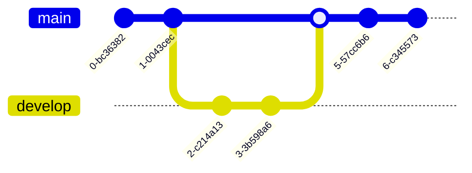
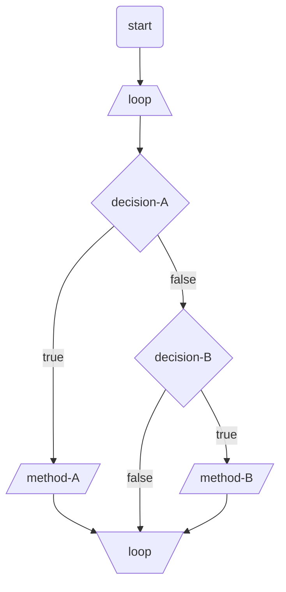

# はじめに

:::message alert

- この記事は Mermaid に関する記事をまとめるためにもので随時更新していく予定です。
  ⚠️ マークがついてる項は現在作成中ですのでしばらくお待ちいただけますと幸いです。

:::

フローチャート図やシーケンス図。マインドマップなどなど。
仕事をする上で図解で資料やドキュメントを作成する機会はどんな職種にでもあるでしょう。

これらの図を作るためのサービスは色々あります。[cacoo](https://cacoo.com/ja/home) や [miro](https://miro.com/ja/) などなど。

そんな中で今回 [mermaid](https://mermaid-js.github.io/mermaid/#/) というサービスについて扱っていきます。
仕事で [notion](https://www.notion.so/ja-jp) を使っていて、コードブロックとして mermaid を埋め込み可能なので存在は知ってたのですが、思ってた以上に汎用性が高くてとてもいいなとなったので紹介させてください。

# mermaid とは

mermaid はテキストとコードを使用してさまざまな図のビジュアルを表現できます。

使い方は [Markdown](https://ja.wikipedia.org/wiki/Markdown) 記法ベースで Mermaid で定義されたテキストを記述します。
そうすることで JavaScript によりレンダリングされ動的に図が生成される仕組みになってます。

現在サポートされている図の種類は 12 種類です。

- フローチャート
- シーケンス図
- クラス図
- 状態図
- ER 図
- ユーザジャーニー
- ガントチャート
- 円グラフ
- 要件図
- Git グラフ
- C4C(実験的リリース中)
- マインドマップ(実験的リリース中)

各種イメージは以下です。

:::details グラフィックイメージ

**フローチャート**

---


---

**シーケンス図**


---

**クラス図**


---

**状態図**


---

**ER 図**


---

**ユーザジャーニー**


---

**ガントチャート**


---

**円グラフ**


---

**要件図**


---

**Git グラフ**



---

**C4C(実験的リリース中)**


---

**マインドマップ(実験的リリース中)**


:::

# mermaid のメリット

ドキュメントを残すこと、付随してわかりやすく伝えるために作図すること。

これらの精度が高く、常に最新化されているということは個人、チームとしても開発サイクルの向上には必須だと思います。

例えば、こんなお話は決してあり得なくはないのではないでしょうか。

```
ドキュメントを読んでいる時に一枚のキャプチャの添付を確認する。
キャプチャの認識のままプロジェクトに参加するも会話している中で認識のズレを感じた。

原因を確認してみるとドキュメントに添付されていたキャプチャは
だいぶ昔に作られたもので一度も更新されているものではなかった。

直そうにも作成元は誰なのか、ファイルの所存などもよくわからず、
他のタスクも忙しいし後でやろうと思うがそのドキュメント内のキャプチャは一生更新されることはないのであった。

　　  終
制作・著作
━━━━━━━━
　 ⓃⒽⓀ
```

個人的ですが、このようなことにならないため特に要件や仕様がまだまだ流動的に変わるフェーズでは誰でも修正できるようにテキストベースでドキュメントは作成していく方が良いと思う派です。

ですが、やはり図解などがないとどうにも伝えづらいことってありますよね。

そんな時にマークダウン形式で書いたテキストに沿って図が描写される mermaid は図解も差し込めて編集も容易と、いいとこ取りができてプロジェクトの推進に大きく貢献するのではと思っています。

また、加えて自動で描写されるため、ツールや各個人が選択したノードの種類による差異がでないのでデザインが統一される。

几帳面な方の「パワポの自動補完で矢印の位置が微妙にズレるのがきにくわねぇ！！」みたいなのも仕様だと思って納得できる。

この辺りが mermaid を使う上でのメリットかなと思います。

## mermaid のエコシステム

メリットのついでにエコシステムについてです。

ツールを使う上でそのツールの利便性だけでなく他のシステムとも容易に連携できるエコシステムがイケてるかどうかも選定基準ですよね。

例えば [diagrams.net(旧：draw.io)](https://www.diagrams.net/blog/blog-profile.html) なんかは [Confluence](https://www.atlassian.com/wac/software/confluence?) なんかと連携が容易で VSCode の拡張機能である [Draw.io Integration](https://marketplace.visualstudio.com/items?itemName=hediet.vscode-drawio) を使うことでエディタ上でグラフィック操作ができたりするので結構便利だと思います。

では mermaid にはどんなエコシステムがあるのでしょうか。

まずは zenn です。
「mermaid とは」のグラフィックイメージに色々サンプルを載せていますが、あちらは画像ではなく markdown として埋め込んで描写しています。

使い方は以下のようにコードブロックの言語の指定で `mermaid` を指定すると記事上で図がレンダリングされます。

````

````

同じブログサービスとして [Qiita](https://qiita.com/Qiita/items/c07f3262d8f3b25f06c9) でも利用できます。

冒頭で少し触れましたが notion のコードブロックにも対応しています。

[GitHub](https://github.blog/2022-02-14-include-diagrams-markdown-files-mermaid/) でもサポートされました。(これは嬉しい)

VSCode の拡張機能 [Markdown Preview Mermaid Support](https://marketplace.visualstudio.com/items?itemName=bierner.markdown-mermaid) をインストールすることでエディター上でも確認することができます。

VSCode 上で `command⌘` + `shift⇧` + `p`でコマンドパレットを開き `Markdown; Open Preview to the Side` と入力して確認すると mermaid が描写されることが確認できます。


また、[npm](https://www.npmjs.com/package/mermaid) として公開されていますので、システムへの導入も容易です。

クイックに確認したい人は以下の HTML ファイルを作成してローカルサーバで起動して確認してみてください。

```html
<!DOCTYPE html>
<html lang="en">
  <head>
    <meta charset="utf-8" />
  </head>
  <body>
    <pre class="mermaid">
  graph LR
      A --- B
      B-->C[fa:fa-ban forbidden]
      B-->D(fa:fa-spinner);
    </pre>
    <script type="module">
      import mermaid from "https://unpkg.com/mermaid@9/dist/mermaid.esm.min.mjs";
      mermaid.initialize({ startOnLoad: true });
    </script>
  </body>
</html>
```

# mermaid のデメリット

メリットだけでなく当然デメリットもあるのでいくつか上げていきます。

まず、専用のグラフィック系のツールを使えば各種ノードをドラッグして繋げるだけで使えるので操作がとても直感的で使いやすいです。

対して mermaid はテキストベースで書かなければいけないので直感的でないし、記法を覚えるというコストもかかります。

デザインも mermaid の仕様に沿ってテキストを定義するので表現の幅にも限界があります。

また、メリットの部分で自動で描写されるので生成された図に対しては仕様として飲み込めると書きましたがやっぱり気になる人は気になるのかなと。(かくゆう私も若干そっち側の人です)

ちょっと一例でループ処理のフローチャートみたいなのを以下に作成してみましたが矢印がうねうね曲がってたりノードの大きさとかがなんとなく気に食わないです。笑



# さいごに

さいごまで読んでいただきありがとうございます。

本記事のまとめは以下です。

- mermaid のメリット
  - markdown のテキスト形式で図を定義できるので修正が容易
  - テキスト定義に沿って描写されるのでデザインの統一性が保てる
  - 各種エコシステムが存在する
    - zenn への markdown の埋め込みが可能
    - Qiita への markdown の埋め込みが可能
    - notion への markdown の埋め込みが可能
    - GitHub への markdown の埋め込みが可能
    - npm パッケージとしてシステムに導入可能
- mermaid のデメリット
  - テキストベースなので覚えるコストがかかる
  - 直感的な操作ができない
  - 仕様から外れた表現はできない
  - デザインの自由度が低い

詳細に知りたい方は以下の各種リンクからサンプルを確認してみてください。

それではまた次の記事でお会いしましょう。

# もっと詳しく

「グラフィックイメージ」で載せた各図に対してもう少し深掘りしてどの程度まで表現可能か知りたい方は以下を参照ください。

## ⚠️ フローチャート

## ⚠️ シーケンス図

## ⚠️ クラス図

## ⚠️ 状態図

## ⚠️ER 図

## ⚠️ ユーザジャーニー

## ⚠️ ガントチャート

## ⚠️ 円グラフ

## ⚠️ 要件図

## ⚠️Git グラフ

## ⚠️C4C(実験的リリース中)

## ⚠️ マインドマップ(実験的リリース中)
